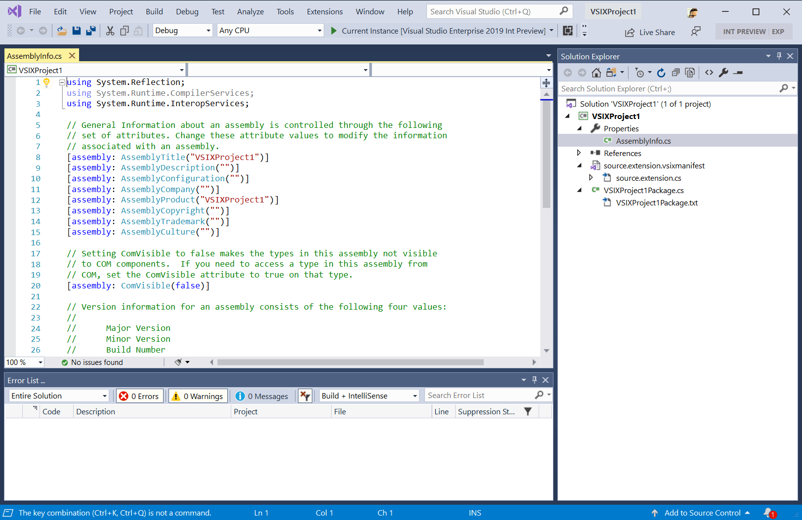
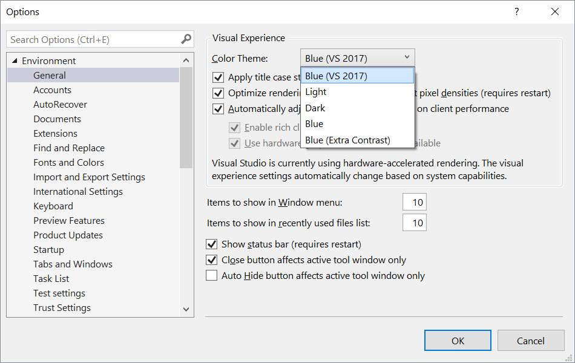

# Original Blue Color Theme

Download the extension at the
[Visual Studio Marketplace](https://marketplace.visualstudio.com/items?itemName=MadsKristensen.CodeCleanupOnSave)
or try the
[CI build](http://vsixgallery.com/extension/efb2984f-c529-413f-b717-1e3d44a495a7/).

---------------------------------------

The original blue color theme from Visual Studio 2017 now available for Visual Studio 2019.

After installing the extension, the **Blue (VS 2017)** theme becomes available in the dropdown under *Tools -> Options*.

## License
[Apache 2.0](LICENSE)
